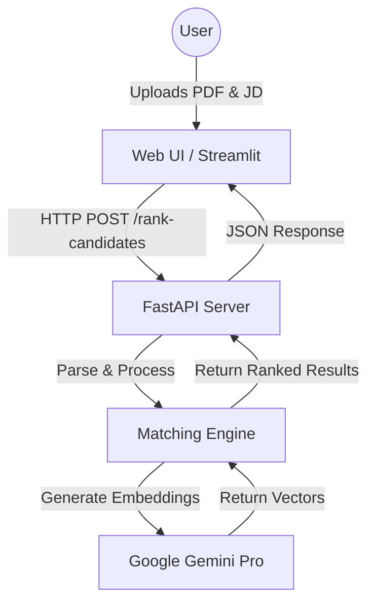

# SmartFit AI - Semantic Resume Matcher


SmartFit AI is a powerful tool that uses Google's Generative AI to semantically match candidate resumes against job descriptions. Unlike keyword-based matchers, SmartFit understands the context and meaning of skills and experiences to provide a more accurate ranking of candidates.

SmartFit validates resumes against a Job Description (JD) using pure semantic meaning. Simply input the JD, bulk upload PDF resumes, and let the AI calculate an alignment score based on intent, not just keywords.

## Features

- **Semantic Matching**: Uses Google's `text-embedding-004` model to understand context.
- **Resume Parsing**: Extracts text from PDF resumes.
- **Ranked Results**: Provides a scored list of candidates based on relevance.
- **Dual Interface**:
  - **CLI**: Simple command-line interface for quick testing with mock data.
  - **REST API**: FastAPI-based server for integrating with frontend applications.

## Prerequisites

- Python 3.11 or higher
- [Poetry](https://python-poetry.org/docs/#installation) for dependency management
- A Google Cloud API Key with access to Generative AI (Gemini)

## Installation

1. **Clone the repository**

   ```bash
   git clone https://github.com/amankishore32/smart-fit.git
   cd smart-fit
   ```

2. **Install dependencies**
   ```bash
   poetry install
   ```

## Configuration

1. Create a `.env` file in the root directory:

   ```bash
   touch .env
   ```

2. Add your Google API Key to the `.env` file:
   ```env
   GOOGLE_API_KEY=your_actual_api_key_here
   ```

## Usage

### 1. Command Line Interface (CLI)

Run the CLI to match mock candidates against a sample job description:

```bash
poetry run python main.py
```

This will test the semantic matching engine with sample data.

### 2. REST API Server

Start the FastAPI server to handle file uploads and real-time matching:

```bash
poetry run python api.py
```

The server will start at `http://0.0.0.0:8000`.
You can access the interactive API documentation at `http://localhost:8000/docs`.

**API Endpoint:**

- `POST /rank-candidates` - Submit job description and PDF resumes for semantic ranking

### 3. Web UI (Streamlit)

Launch the Streamlit web interface for an intuitive user experience:

```bash
poetry run streamlit run ui.py
```

The app will open at `http://localhost:8501`.

**Web UI Features:**

- Intuitive sidebar for job description and resume uploads
- Real-time semantic ranking with color-coded scores
- Top candidate highlight
- Detailed results table with filename, score, preview, and status
- Raw JSON response viewer for debugging

## Project Structure

```
smart-fit/
├── api.py           # FastAPI server with /rank-candidates endpoint
├── data.py          # Mock data for testing and demonstration
├── engine.py        # Core semantic matching engine using Gemini
├── main.py          # CLI entry point for command-line usage
├── ui.py            # Streamlit web interface
├── utils.py         # Utility functions (PDF extraction, text processing)
├── pyproject.toml   # Project dependencies managed by Poetry
├── poetry.lock      # Locked dependency versions
├── README.md        # Project documentation
└── .env             # Environment variables (not committed)
```

## Key Components

### api.py

- Defines FastAPI endpoints for the REST API
- Handles file uploads and multipart form data
- Routes requests to the matching engine
- Returns ranked candidates with scores

### engine.py

- Core semantic matching logic
- Uses Google's Generative AI embeddings
- Calculates similarity scores between job description and resumes
- Ranks candidates by relevance

### ui.py

- Streamlit frontend application
- Provides user-friendly interface for job description and resume upload
- Displays ranked results with visual indicators (gradient coloring)
- Connects to FastAPI backend for processing

### utils.py

- PDF text extraction functionality
- Text preprocessing utilities
- Helper functions for data processing

## Architecture



## How It Works

1. **Input**: User provides a job description and uploads candidate resumes (PDF)
2. **Processing**:
   - PDFs are extracted to text
   - Job description is vectorized using Google's embedding model
   - Each resume is vectorized using the same model
3. **Matching**: Cosine similarity is calculated between the job description and each resume
4. **Ranking**: Candidates are ranked by similarity score (0-100%)
5. **Output**: Sorted list of candidates with relevance scores

## Error Handling

Common issues and solutions:

| Error                                     | Cause                  | Solution                                  |
| ----------------------------------------- | ---------------------- | ----------------------------------------- |
| `No module named 'chromadb'`              | Missing dependencies   | Run `poetry install`                      |
| `Failed to connect to backend`            | API server not running | Start API with `poetry run python api.py` |
| `GOOGLE_API_KEY not set`                  | Missing API key        | Add API key to `.env` file                |
| `background_gradient requires matplotlib` | Missing matplotlib     | Run `poetry install`                      |

## Author

**Aman Kishore Agarwal**
